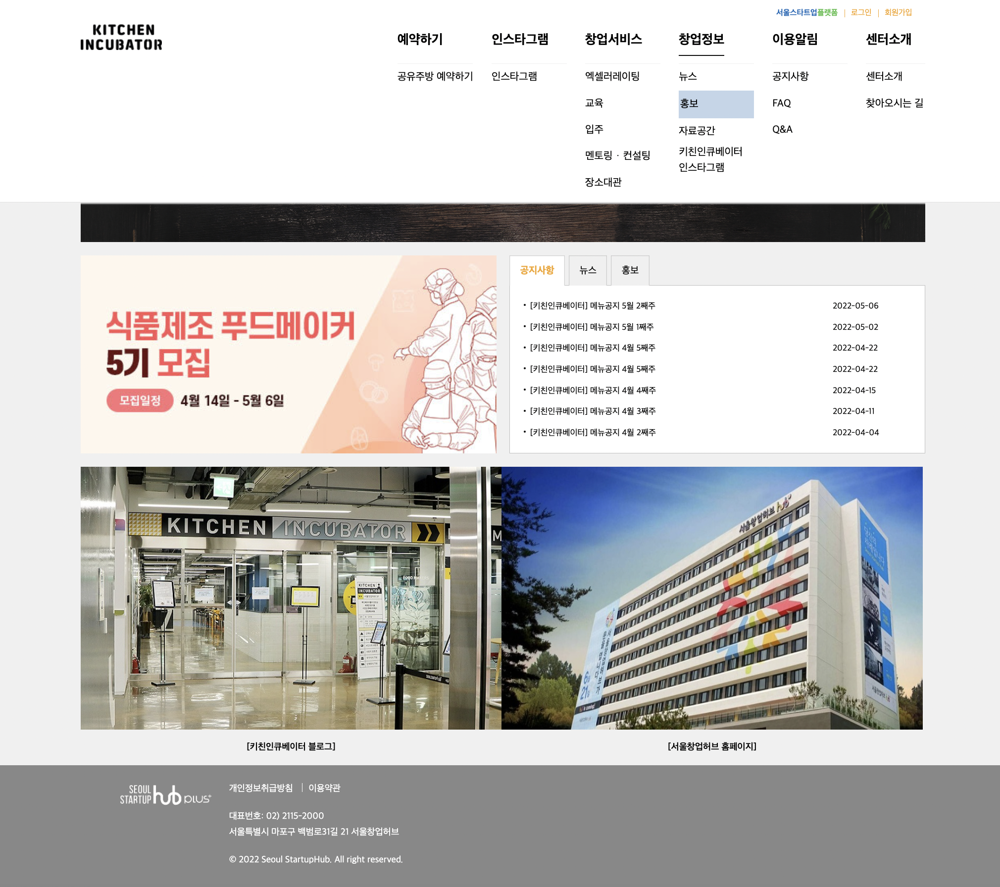

# 키친 인큐베이터

키친 인큐베이터 클론코딩을 진행하였습니다.
 

## 📎 사이트

- 기존 주소 : https://hubkitchen.startup-plus.kr/default.do
- 배포 주소 : https://yxxnhx-kichen-clone.netlify.app/
   

## 📅 기간

2022.05.09~2022.05.15
 

## 🏹 Skills

- HTML
- CSS
- Netlify

## 🔎 Detail

- HTML, CSS 연습을 위해 첫 클론코딩을 진행하였습니다. 헤더 위에 호버 시 메뉴가 내려오며 2depth를 클릭하거나 호버를 할 때에는 색이 들어오는 효과를 주었습니다.
- netlify를 통한 배포 연습 또한 함께 진행하여 배포 구조에 대하여 배웠습니다.
   

## 🚀 Result

 

## 📍 Review

키친 인큐베이터 클론 코딩을 진행하면서 처음으로 클론코딩을 진행하다보니 막히는 부분들이 많았습니다. 헤더 부분이 전체가 내려와야 하는데 inner로 쌓여있어 해당 부분이 진행되지 않았습니다. inner로 감싸서 한꺼번에 화면의 중앙에 두고 싶어서 그렇게 배치하였는데 전체 너비가 내려와야 하기 때문에 제대로 진행이 되지 않았습니다.
이 부분은 inner를 gnb 내부에 감싸고 header에 hover하였을 때 header의 높이가 늘어나는 형식으로 진행하여 해결하였습니다. 구조를 짤 때에는 나무를 보지 말고 숲을 보며 전체적인 흐름을 생각하여 짜야 한다는 것을 알게 되었습니다.
